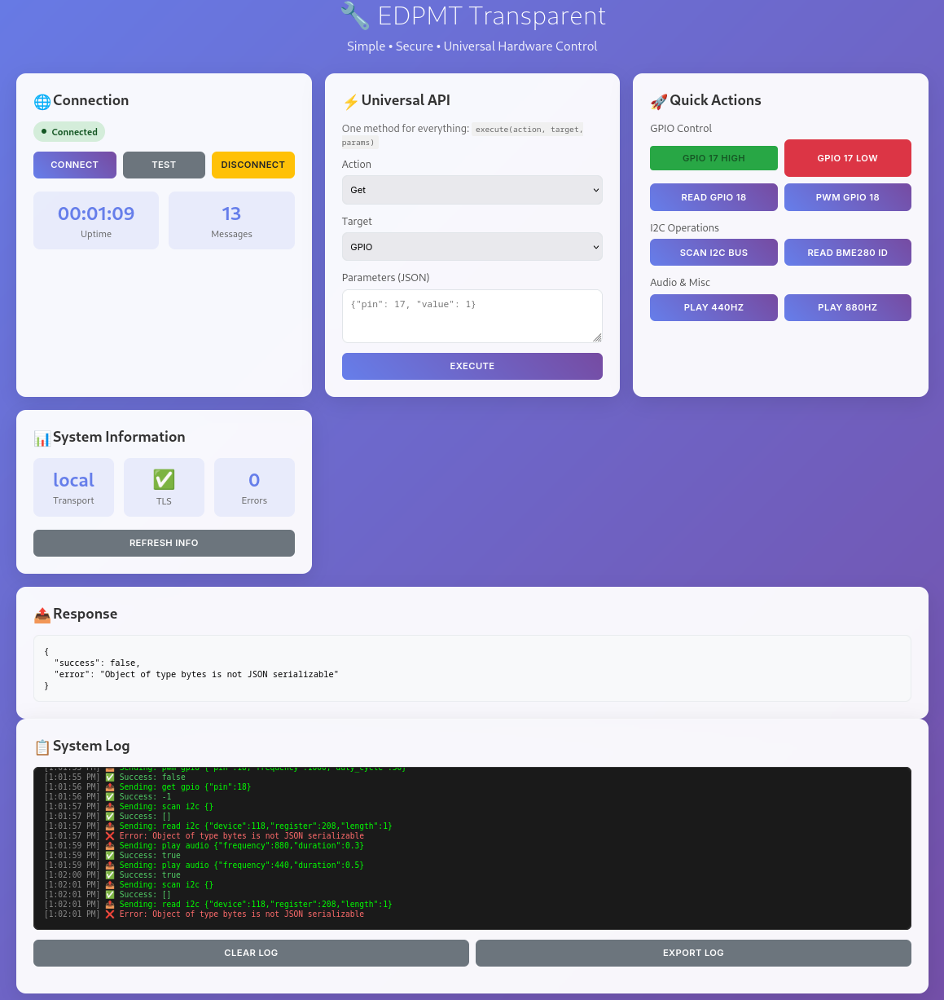

# EDPMT - Electronic Device Protocol Management (Transparent)

[](https://opensource.org/licenses/Apache-2.0)
[](https://www.python.org/downloads/)
[](https://github.com/stream-ware/edpmt)
[](https://hub.docker.com/)

**Simple • Secure • Universal Hardware Communication**

EDPMT is a revolutionary hardware communication library that provides a transparent, zero-configuration solution for controlling GPIO, I2C, SPI, UART, and other hardware interfaces. Built from the ground up with security, simplicity, and transparency in mind.

## 🌟 Key Features

### **🚀 Radical Simplicity**
- **Single Universal Method**: One `execute(action, target, params)` method for everything
- **Zero Configuration**: Automatic detection of transport, TLS, and hardware
- **Minimal Dependencies**: Only 2-3 required packages vs 15+ in traditional solutions
- **One File Deployment**: Complete functionality in a single transparent module

### **🔐 Security First**
- **Automatic TLS Encryption**: Self-signed certificates generated automatically  
- **HTTPS/WSS by Default**: Secure communication out of the box
- **Optional Let's Encrypt**: Easy integration with production certificates
- **No Hardcoded Secrets**: No API keys, UUIDs, or hash authentication needed

### **🎯 Complete Transparency**
- **Full Operation Logging**: Every action logged with clear timestamps
- **Linear Data Flow**: Simple `Client → TLS → Server → Hardware → Response`
- **Debug-Friendly**: Easy troubleshooting with comprehensive logs
- **Layer Separation**: Clean architecture with distinct responsibilities

### **🌐 Universal Access**
- **Cross-Platform**: Linux, Windows, macOS support
- **Multi-Language API**: Same interface for Python, JavaScript, curl, etc.
- **Transport Auto-Selection**: IPC (local), TLS (network), WSS (browser)
- **Hardware Abstraction**: Works with real hardware or simulators

## 📦 Installation

### **🚀 Development Setup (Recommended)**

**For modern Python environments with externally-managed-environment:**

```bash
# Clone repository
git clone https://github.com/stream-ware/edpmt.git
cd edpmt

# Setup development environment (no pip installation needed)
make dev-setup

# Start using EDPMT immediately
./bin/edpmt server --dev --port 8877
./bin/edpmt info
./bin/edpmt --help
```

### **🐍 Virtual Environment Setup**

```bash
# Create isolated virtual environment
make venv-setup

# Activate and use
source venv/bin/activate
edpmt server --dev --port 8877
```

### **📦 Traditional Installation (if supported)**

```bash
# Install from PyPI (when published)
pip install edpmt

# Or install from source (may fail on managed environments)
git clone https://github.com/stream-ware/edpmt.git
cd edpmt
pip install -e .
```

### **🔧 Hardware Support (Raspberry Pi)**

```bash
# With dev-setup - hardware libraries auto-detected
make dev-setup
./bin/edpmt server --dev  # Auto-falls back to simulators

# With pip installation
pip install edpmt[rpi]     # Raspberry Pi GPIO support
pip install edpmt[all]     # All optional dependencies
```

### **Requirements**

- **Python 3.8+** (3.9+ recommended)
- **Linux/Windows/macOS** (Linux recommended for hardware access)
- **Optional**: Docker for containerized deployment

**Core Dependencies** (installed automatically):
- `aiohttp` - HTTP server and client
- `aiohttp-cors` - Cross-origin resource sharing
- `cryptography` - TLS certificate generation
- `websockets` - WebSocket communication

**Hardware Dependencies** (optional):
- `RPi.GPIO` - Raspberry Pi GPIO control
- `smbus2` - I2C communication
- `spidev` - SPI communication  
- `pyserial` - UART/Serial communication

## 🚀 Quick Start

### **1. Start the Server**

```bash
# Start with TLS (recommended)
edpmt server --tls --port 8888

# Or start in development mode (auto TLS + debug)
edpmt server --dev
```

**Access Points:**
- 🌐 **Web Interface**: https://localhost:8888
- 🔌 **REST API**: https://localhost:8888/api/execute
- 📡 **WebSocket**: wss://localhost:8888/ws
- 💚 **Health Check**: https://localhost:8888/health

### **2. Control Hardware**

**Python Client:**
```python
import asyncio
from edpmt import EDPMClient

async def main():
    # Auto-detects server URL and TLS settings
    client = EDPMClient()
    
    # GPIO Control
    await client.execute('set', 'gpio', pin=17, value=1)  # LED ON
    await client.execute('set', 'gpio', pin=17, value=0)  # LED OFF
    state = await client.execute('get', 'gpio', pin=18)   # Read pin
    
    # I2C Communication
    devices = await client.execute('scan', 'i2c')
    data = await client.execute('read', 'i2c', 
                               device=0x76, register=0xD0, length=1)
    
    # PWM Control
    await client.execute('pwm', 'gpio', 
                        pin=18, frequency=1000, duty_cycle=50)
    
    # Audio Generation
    await client.execute('play', 'audio', frequency=440, duration=1.0)
    
    await client.close()

asyncio.run(main())
```

**JavaScript/Browser:**
```javascript
// WebSocket connection (real-time)
const ws = new WebSocket('wss://localhost:8888/ws');
ws.onopen = () => {
    // Control GPIO
    ws.send(JSON.stringify({
        action: 'set',
        target: 'gpio',
        params: { pin: 17, value: 1 }
    }));
};

// HTTP REST API (simple)
fetch('https://localhost:8888/api/execute', {
    method: 'POST',
    headers: { 'Content-Type': 'application/json' },
    body: JSON.stringify({
        action: 'scan',
        target: 'i2c'
    })
}).then(r => r.json()).then(console.log);
```

**Command Line:**
```bash
# Single command execution
edpmt client --execute set gpio '{"pin": 17, "value": 1}'

# Interactive mode
edpmt client --interactive
> set gpio {"pin": 17, "value": 1}
> scan i2c
> play audio {"frequency": 440, "duration": 1.0}

# Using curl
curl -k https://localhost:8888/api/execute \
  -H "Content-Type: application/json" \
  -d '{"action":"set","target":"gpio","params":{"pin":17,"value":1}}'
```

## 🐳 Docker Deployment

### **Raspberry Pi 3 with Docker Compose**

```bash
# Clone repository
git clone https://github.com/stream-ware/edpmt.git
cd edpmt/examples/docker

# Start full stack (EDPMT + MQTT + InfluxDB + Grafana)
docker-compose up -d

# Access services:
# - EDPMT Web UI: https://localhost:8888
# - Grafana Dashboard: http://localhost:3000 (admin/admin)
# - MQTT Broker: localhost:1883
```

### **Single Container (Minimal)**

```bash
# Build EDPMT image
docker build -t edpmt .

# Run with hardware access
docker run -d --name edpmt-server \
  --device /dev/gpiomem \
  --device /dev/i2c-1 \
  --device /dev/spidev0.0 \
  --device /dev/spidev0.1 \
  -p 8888:8888 \
  -v edpmt-certs:/app/certs \
  -v edpmt-logs:/app/logs \
  -e EDPM_TLS=true \
  -e EDPM_PORT=8888 \
  edpmt
```

### **Environment Variables**

| Variable | Default | Description |
|----------|---------|-------------|
| `EDPM_PORT` | `8888` | Server port |
| `EDPM_HOST` | `0.0.0.0` | Bind address |
| `EDPM_TLS` | `true` | Enable TLS encryption |
| `EDPM_DEV` | `false` | Development mode (debug + relaxed TLS) |
| `EDPM_URL` | Auto | Client connection URL |
| `EDPM_CERT_PATH` | `/app/certs` | Certificate storage path |
| `EDPM_LOG_LEVEL` | `INFO` | Logging verbosity |

## 🔌 API Reference

### **Universal Execute Method**

```python
await client.execute(action: str, target: str, **params) -> Any
```

### **GPIO Operations**

```python
# Digital I/O
await client.execute('set', 'gpio', pin=17, value=1)        # Set HIGH
await client.execute('set', 'gpio', pin=17, value=0)        # Set LOW
state = await client.execute('get', 'gpio', pin=18)         # Read pin

# PWM Control
await client.execute('pwm', 'gpio', pin=18, frequency=1000, duty_cycle=50)
await client.execute('pwm', 'gpio', pin=18, frequency=0)    # Stop PWM

# Pin Configuration
await client.execute('config', 'gpio', pin=17, mode='out') # Output mode
await client.execute('config', 'gpio', pin=18, mode='in', pull='up') # Input with pullup
```

### **I2C Operations**

```python
# Device Discovery
devices = await client.execute('scan', 'i2c')              # Scan bus for devices

# Data Transfer
data = await client.execute('read', 'i2c', device=0x76, register=0xD0, length=1)
await client.execute('write', 'i2c', device=0x76, register=0xF4, data=[0x27])

# Raw I2C
data = await client.execute('read_raw', 'i2c', device=0x76, length=6)
await client.execute('write_raw', 'i2c', device=0x76, data=[0x1, 0x2, 0x3])
```

### **SPI Operations**

```python
# SPI Transfer
response = await client.execute('transfer', 'spi', data=[0x01, 0x02, 0x03])

# SPI Configuration
await client.execute('config', 'spi', bus=0, device=0, 
                     speed=1000000, mode=0, bits=8)
```

### **UART/Serial Operations**

```python
# Send Data
await client.execute('write', 'uart', data="Hello World\n")

# Read Data  
data = await client.execute('read', 'uart', timeout=1.0)

# Configuration
await client.execute('config', 'uart', port='/dev/ttyUSB0', 
                     baudrate=9600, timeout=1.0)
```

## 📚 Complete Examples

See the [`examples/`](examples/) directory for complete project implementations:

- **[LED Controller](examples/rpi3-gpio/led-controller/)**: Multi-pattern RGB LED controller
- **[Docker Setup](examples/docker/)**: Complete containerized deployment
- **[PC Simulation](examples/pc-simulation/)**: Cross-platform hardware simulation

## 🛠️ CLI Usage

**⚠️ Important: Use local wrapper script `./bin/edpmt` for development setup**

```bash
# Server management (development setup)
./bin/edpmt server --dev                    # Start in development mode
./bin/edpmt server --dev --port 8877        # Custom port
./bin/edpmt info                            # Show system information
./bin/edpmt --help                          # Show all commands

# Client operations
./bin/edpmt client --url https://localhost:8877  # Connect to server
./bin/edpmt client --interactive                 # Interactive mode

# Alternative with system installation
edpmt server --dev                    # Only if installed via pip/venv
edpmt info                            # System-wide command
```

## 🔧 Troubleshooting

### **Common Installation Issues**

**Problem: `bash: edpmt: command not found`**
```bash
# ❌ Don't use: edpmt server --dev
# ✅ Use instead: ./bin/edpmt server --dev
```

**Problem: `externally-managed-environment` error**
```bash
# Solution 1: Use development setup (recommended)
make dev-setup
./bin/edpmt server --dev

# Solution 2: Use virtual environment
make venv-setup
source venv/bin/activate
edpmt server --dev
```

**Problem: `'NoneType' object has no attribute 'setup'` errors**
```bash
# Fixed in latest version - hardware interfaces now properly fall back to simulators
./bin/edpmt server --dev  # Should run without hardware errors
```

**Problem: `[Errno 98] address already in use`**
```bash
# Use different port
./bin/edpmt server --dev --port 8877
./bin/edpmt server --dev --port 9999
```

### **Development Workflow**

```bash
# 1. Clone and setup
git clone https://github.com/stream-ware/edpmt.git
cd edpmt

# 2. Development setup (no installation needed)
make dev-setup

# 3. Start server
./bin/edpmt server --dev --port 8877

# 4. Access web interface
# Open: https://localhost:8877

# 5. Run tests
make test
```

## 🔧 Development

### **Setup Development Environment**

```bash
# Clone repository
git clone https://github.com/stream-ware/edpmt.git
cd edpmt

# Create virtual environment
python -m venv venv
source venv/bin/activate  # Linux/macOS
# or: venv\Scripts\activate  # Windows

# Install in development mode
pip install -e .[dev]

# Start development server
edpmt server --dev
```

## 📄 License

This project is licensed under the **Apache License 2.0** - see the [LICENSE](LICENSE) file for details.

## 🙋 Support

- **Issues**: [GitHub Issues](https://github.com/stream-ware/edpmt/issues)
- **Documentation**: [Architecture Document](edpm-transparent-architecture.md)
- **Examples**: [Complete Examples](examples/)

---

**Made with ❤️ for simple, secure, and transparent hardware communication**

# EDPM Transparent (EDPMT)

EDPM Transparent (EDPMT) is a simple, secure, and universal server framework designed for hardware interaction and control. It provides a hardware-agnostic architecture with pluggable interfaces, allowing seamless switching between real hardware and simulators.

## Key Features

- **Single Universal API**: Use `execute(action, target, params)` for all hardware interactions.
- **Automatic TLS**: Secure communication with self-signed certificates.
- **Multi-Transport Support**: Supports Local IPC, Network TLS, and Browser WSS.
- **Hardware Abstraction**: Automatically falls back to simulators if real hardware is unavailable.
- **Zero Configuration**: Auto-detection of hardware and environment settings.
- **Comprehensive Web Interface**: Real-time control and monitoring.
- **Docker Support**: Easy deployment with hardware access.
- **Full Logging and Transparency**: Detailed logs for debugging and monitoring.

## Installation

To install EDPMT, follow these steps:

```bash
# Clone the repository
git clone https://github.com/stream-ware/edpmt.git
cd edpmt

# Set up for development
make dev-setup
```

For detailed installation instructions and troubleshooting, refer to the [Installation Guide](#installation-guide) section below.

## Usage

### Starting the Server

```bash
# Start the server in development mode with simulators
make server-dev-sim

# Or use the CLI directly
./bin/edpmt server --dev --hardware-simulators
```

### Accessing the Server

Once the server is running, you can access:
- **Web Interface**: `https://<host>:<port>` (default: `https://0.0.0.0:8888`)
- **REST API**: `https://<host>:<port>/api/execute`
- **WebSocket**: `wss://<host>:<port>/ws`
- **Health Check**: `https://<host>:<port>/health`

## Hardware-Agnostic Framework

EDPMT now features a hardware-agnostic framework with pluggable hardware interfaces. This allows dynamic setup of hardware during initialization, with fallback to simulators if real hardware is unavailable. Currently supported interfaces include:
- **GPIO**: Real (Raspberry Pi) and Simulated implementations.
- **I2C**: Real (SMBus) and Simulated implementations.
- **SPI, UART, USB, I2S**: Dummy implementations (to be expanded with real and simulated versions).

To run the server with simulated hardware:
```bash
make server-dev-sim
```

## Examples

EDPMT comes with several examples to demonstrate its capabilities. You can find them in the `examples` directory:

- **[Complete Projects](examples/complete-projects/)**: Full-fledged projects showcasing comprehensive use of EDPMT.
- **[Docker Setup](examples/docker/)**: Docker configuration for running EDPMT on Raspberry Pi 3 with hardware access.
  - [Dockerfile](examples/docker/Dockerfile)
  - [docker-compose.yml](examples/docker/docker-compose.yml)
  - [docker-entrypoint.sh](examples/docker/docker-entrypoint.sh)
  - [README.md](examples/docker/README.md)
- **[GPIO Frontend](examples/gpio-frontend/)**: A web frontend for GPIO control using EDPMT.
  - [app.py](examples/gpio-frontend/app.py)
  - [README.md](examples/gpio-frontend/README.md)
  - [templates/](examples/gpio-frontend/templates/)
- **[PC Simulation](examples/pc-simulation/)**: Examples for simulating hardware interactions on a PC.
  - [gpio_led_matrix.py](examples/pc-simulation/gpio_led_matrix.py)
  - [i2c_sensor_simulation.py](examples/pc-simulation/i2c_sensor_simulation.py)
  - [README.md](examples/pc-simulation/README.md)
  - [spi_device_simulation.py](examples/pc-simulation/spi_device_simulation.py)
  - [uart_communication.py](examples/pc-simulation/uart_communication.py)
- **[Raspberry Pi 3 GPIO LED Controller](examples/rpi3-gpio/led-controller/)**: A specific example for controlling LEDs on Raspberry Pi 3 using GPIO.
  - [app.py](examples/rpi3-gpio/led-controller/app.py)

## Installation Guide

### Prerequisites

- Python 3.6 or higher
- Access to hardware (Raspberry Pi for real hardware interaction) or use simulators

### Steps

1. **Clone the Repository**:
   ```bash
   git clone https://github.com/stream-ware/edpmt.git
   cd edpmt
   ```
2. **Development Setup**:
   ```bash
   make dev-setup
   ```
3. **Running the Server**:
   - For development with simulators:
     ```bash
     make server-dev-sim
     ```
   - For development with real hardware:
     ```bash
     make server-dev
     ```

### Troubleshooting

- **Server Fails to Start**: Ensure no other process is using the default port (8888). Use the `--port` option to specify a different port.
- **Hardware Not Detected**: Verify hardware connections and permissions. Use `--hardware-simulators` flag to test with simulated hardware.
- **TLS Errors**: If you encounter certificate issues, use `--no-tls` to disable TLS temporarily for debugging.

## Contributing

Contributions to EDPMT are welcome! Please follow these steps:
1. Fork the repository.
2. Create a new branch for your feature or bug fix.
3. Make your changes and commit them with descriptive messages.
4. Push your changes to your fork.
5. Create a pull request with a detailed description of your changes.

## License

EDPMT is licensed under the Apache 2.0 License. See [LICENSE](LICENSE) for more information.